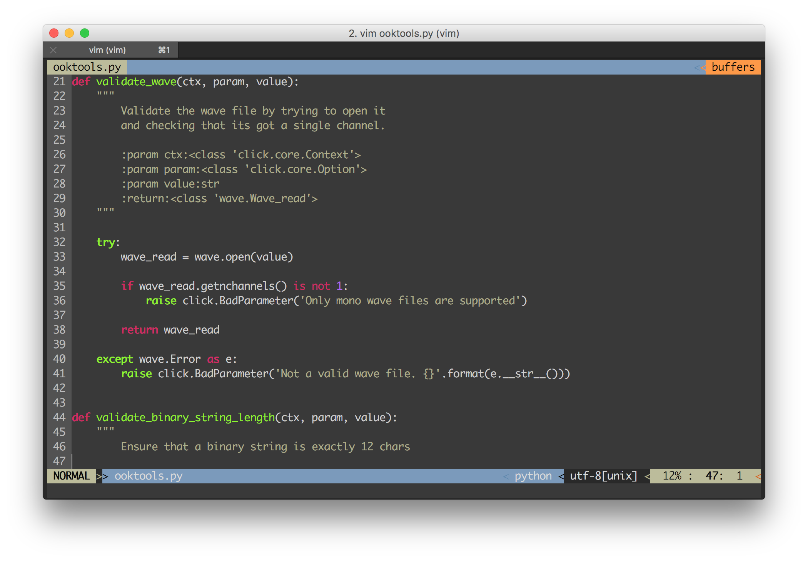
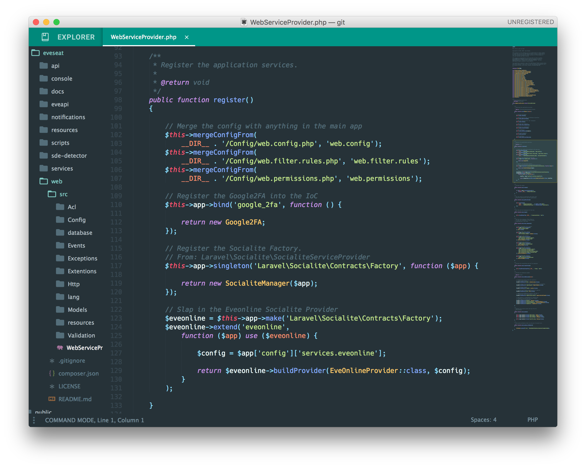
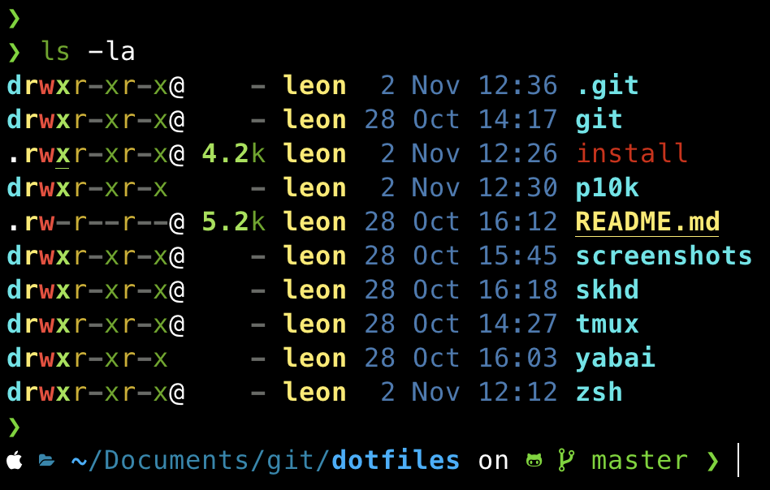
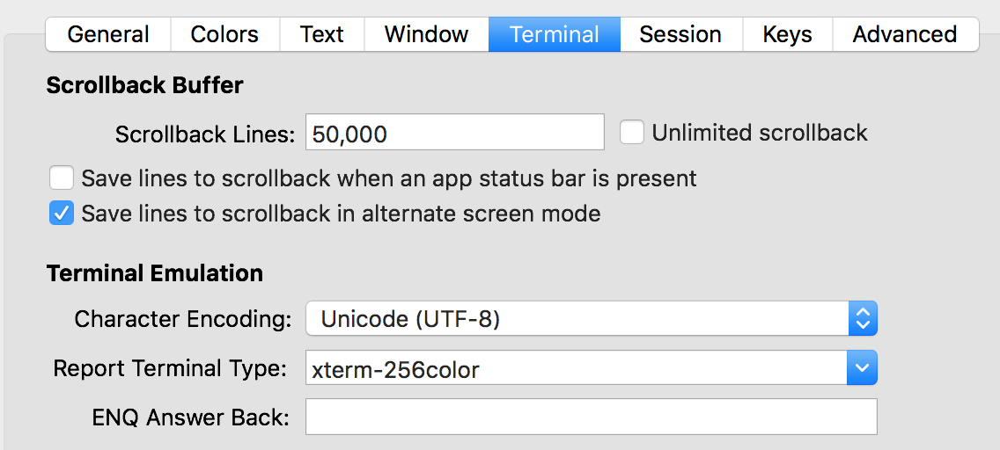

# dotfiles
Dotfile Configurations

This repository contains my public dotfiles. It includes a `Makefile` for installation. By default, everyting is installed. If you only wanted certain parts, then run `make` and the name of the part you want.

## screenshots
### Vi

### Sublime Text

### Zsh


## installation
Install these dotfile with the following command (installs all of the sections)
```bash
curl -fsSL https://raw.githubusercontent.com/leonjza/dotfiles/master/Makefile -o && make
````

To make sure the colors show correctly, as well as the unicode displays correctly, ensure that your `TERM` and `LANG` environment variables are set in your shell:

```bash
~ » env | egrep "LANG=|TERM="
LANG=en_US.UTF-8
TERM=xterm-256color
```

You should probably also set this in your terminal emulator(iTerm2 in my case):


## uninstall
```bash
make uninstall
```

## available parts
```bash
make zsh_install
make vim_install
make tmux_install
```
