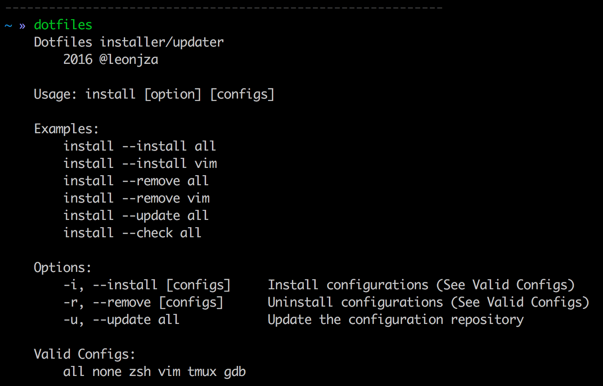
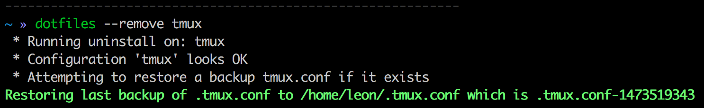
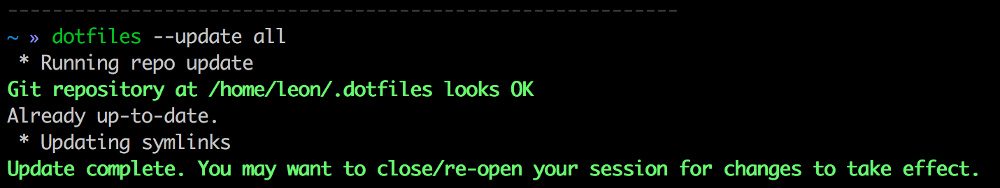
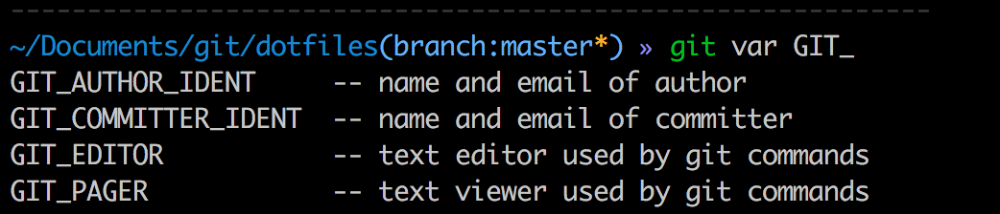
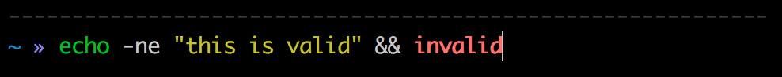
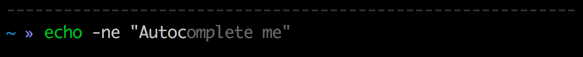
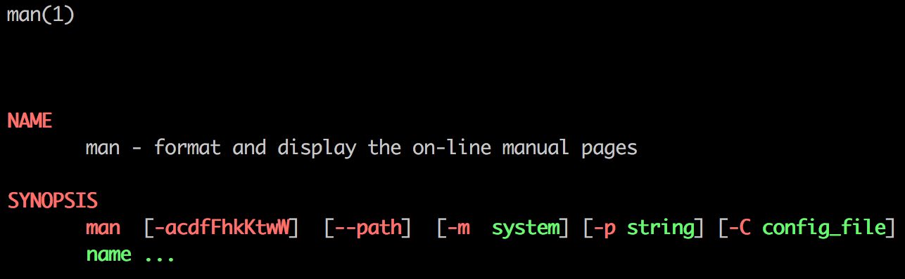
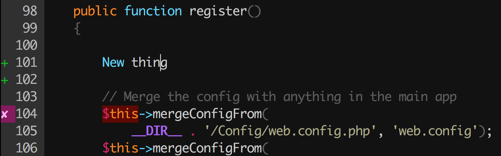
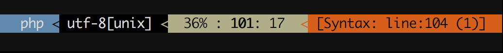

# ⚡️.dotfiles | batteries included dotfile configurations
This repository contains my public dotfiles. It comes with a single installer that will take care of installing, updating and backing up your existing configurations.

To see what things look like, skip straight to [screenshots](#screenshots)!

## toc

- [installing](#installing)
- [uninstalling](#uninstalling)
- [updating](#updating)
- [screenshots](#screenshots)
- [whats included](#whats-included)
- [extending](#extending)
- [errors](#errors)

## installing
The following command will install everything, backing up existing configs first and make available a new `dotfiles` command:

`bash <(curl -fsSL https://raw.githubusercontent.com/leonjza/dotfiles/master/install) --install all`

After installation, a new `dotfiles` command will be come available that will do exactly the same as the above command. In fact, its just an [alias](https://github.com/leonjza/dotfiles/blob/master/dotfiles.d/zshrc.d/aliases.zsh#L2).



## uninstalling
If for any reason you just cant get to like these configurations, removing them should be as easy as:

`dotfiles --remove all`  
_If you no longer can access the `dotfiles` command, substitute it with the `bash <(curl)` command used as first installation_

You can also remove only certain parts of the configs. For example, to remove `tmux` configurations simply run `dotfiles --remove tmux`:



## updating
Like what changed since you last installed? Just update your local install with:

`dotfiles --update all`

*Note:* When you update, symlinks will be re-created. Don't worry though, anything else you place in the `.dotfiles.d/*` folders will not be affected.



## screenshots
### Vi
Editing a python source file.

### Sublime Text
Editing a PHP source file.

### Zsh
Shell history completion.


## whats included

These dotfiles contain a number of maybe surprising things! Lets take a quick look.

### zsh
| Command        | Type           | Source  | Description |
| ------------- |:-------------:|:------:| ------------|
| `dotfiles`      | alias | [view](https://github.com/leonjza/dotfiles/blob/master/dotfiles.d/zshrc.d/aliases.zsh) | Convenience command to the `dotfiles` installer |
| `chain`      | alias      | [view](https://github.com/leonjza/dotfiles/blob/master/dotfiles.d/zshrc.d/aliases.zsh) | Convenience alias to `proxychains` |
| `please` | alias  | [view](https://github.com/leonjza/dotfiles/blob/master/dotfiles.d/zshrc.d/aliases.zsh) | Run the last command again as root |
| `p` | alias | [view](https://github.com/leonjza/dotfiles/blob/master/dotfiles.d/zshrc.d/aliases.zsh) | Convenience alias to `passpie` |
| `nah` | alias | [view](https://github.com/leonjza/dotfiles/blob/master/dotfiles.d/zshrc.d/aliases.zsh) | Convenience alias to undo all of your changes in the current git branch |
| `ports` | alias | [view](https://github.com/leonjza/dotfiles/blob/master/dotfiles.d/zshrc.d/aliases.zsh) | Convenience alias to view open ports on macOS |
| `locate` | alias | [view](https://github.com/leonjza/dotfiles/blob/master/dotfiles.d/zshrc.d/aliases.zsh) | Convenience alias to make `mdfind` behave like `locate` on macOS |
| `extract` | zsh plugin | [view](https://github.com/leonjza/dotfiles/blob/master/rc/zshrc) | *Very* convenient alias plugin that lets you extract almost any archive with `extract something.tar.gz` |

Apart from the commands, there are also things like:

- A clean shell prompt. Shows current path and git branch of applicable.
- `git` command auto completion as well as visual indicators of your current working branch and if your local branch has uncommitted changes.



- Shell syntax highlighting. Green text means the command exists, red means it doesn't.



- Shell command autocomplete based off command history. Type that long command, see a grey suggested area of the last, similar command in your history and hit the right arrow key to complete it.



- Colored man pages. I need not say more.



### vim
- A theme that is really easy on the eye, imo anyways.
- A sexy syntax checker that will let you know as you save the file where a line of code may cause syntax/parsing errors.



- A sexy 'powerline' that can give you status updates, like something about that syntax error you have.



- An git-like indicator showing which lines of code have changed / been added & removed based on the current git repository.


- A few other **sane** defaults. Well, sane for me anyways ;)

## extending
The layout of this project is mostly driven by a few core ideas:
- It should be easy to update, no matter what the added config of the install.
- It should be easy to extend the dotfiles and add environment specific files/changes.
- Base rc files should set some required defaults, and then source all other configs from `*.d` style directories.
- It should look good! :)

With that in mind, if you wanted to extend any of the existing configurations, I'd suggest you go and have a look at your local installs `~/.dotfiles.d/` directory and locate the software you want to edit. In the case of `zsh`, it will be `~/.dotfiles.d/zshrc.d/`. In here, you can add any file ending in `.zsh` and it will be included on startup.  

**Dont edit the `.zshrc` file directly, its just a symlink to the dotfiles github repo! Use a `.d` style file.**

I generally just create a file called `local.zsh` in `~/.dotfiles.d/zshrc.d/` with my local overrides and other stuff I need.


Files added to the `*.d` type folders will remain there, even after upgrades and removals. So, keep that in mind!

## errors
Sometimes stuff goes wrong. The most common being colors/weird unicode errors. To make sure the colors show correctly, as well as the unicode displays correctly, ensure that your `TERM` and `LANG` environment variables are set in your shell:

```bash
~ » env | egrep "LANG=|TERM="
LANG=en_US.UTF-8
TERM=xterm-256color
```

You should probably also set this in your terminal emulator (iTerm2 in my case) or as an `export` in your local `~/.dotfiles.d/zshrc.d/config.zsh` file:


